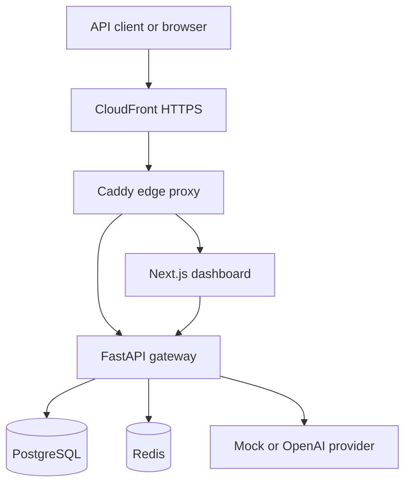

# ModelBudget

ModelBudget is a production-oriented control plane for governing LLM usage across teams. It exposes an OpenAI-compatible gateway, enforces budgets and rate limits, versions approved prompts, records cost-safe usage metadata, and gives operators a read-only dashboard for reviewing system health and spend.

The project is designed as a portfolio demonstration of backend engineering, cloud deployment, security, reliability, and observability—not merely as a UI around an AI API.

## What it demonstrates

- OpenAI-compatible chat completions with provider abstraction and a no-cost mock provider
- Team-level budget enforcement and usage accounting backed by PostgreSQL
- Redis-backed rate limiting and circuit-breaker behavior
- Versioned prompt governance with approval and retirement states
- Read-only operator dashboard built with Next.js and TypeScript
- Signed, HttpOnly dashboard sessions and constant-time credential comparison
- Prometheus metrics and OpenTelemetry tracing with privacy-safe attributes
- Alembic database migrations
- Multi-stage production containers and Docker Compose orchestration
- GitHub Actions CI for backend, migrations, dashboard, and production images
- Terraform-managed AWS deployment using EC2, CloudFront, SSM, IAM, and IMDSv2

## Architecture



CloudFront is the only public entry point. The EC2 security group accepts origin HTTP traffic only from the AWS-managed CloudFront prefix list. There is no inbound SSH rule; administration uses AWS Systems Manager Session Manager and Run Command.

See [docs/architecture.md](docs/architecture.md) for request flows, trust boundaries, and design decisions.

## Technology stack

| Area | Technology |
|---|---|
| Backend | Python 3.12, FastAPI, SQLAlchemy, Alembic |
| Data | PostgreSQL, Redis |
| AI integration | OpenAI-compatible provider adapter and mock provider |
| Dashboard | Next.js 16, React 19, TypeScript |
| Security | HMAC-signed HttpOnly sessions, constant-time comparisons, same-origin enforcement |
| Observability | Prometheus, OpenTelemetry |
| Containers | Docker, Docker Compose, Caddy |
| CI/CD | GitHub Actions |
| Cloud | AWS EC2, CloudFront, SSM Parameter Store, IAM, VPC |
| Infrastructure | Terraform |

## Request flow

1. A client sends an OpenAI-compatible request to the gateway.
2. Authentication, team state, request validation, budget, and rate-limit checks run before provider execution.
3. The routing layer selects the configured provider; production demos default to the mock provider to prevent accidental API charges.
4. Circuit-breaker logic isolates unhealthy provider calls.
5. Usage and calculated cost are persisted without storing prompts or response snapshots.
6. Privacy-safe metrics and traces describe the request outcome.
7. The dashboard reads sanitized aggregate data through an authenticated server-side proxy.

## Local verification

Create local environment files from the committed examples and supply your own secrets. Never commit `.env` or `dashboard/.env.local`.

```bash
docker compose -f docker-compose.yml -f compose.app.yaml up --build
```

Run the offline verification suite documented by the scripts in `scripts/`. Live OpenAI checks are intentionally separate and require explicit credentials.

## Continuous integration

`.github/workflows/ci.yml` runs on pushes and pull requests. It verifies:

- backend code and database migrations;
- dashboard build and security checks;
- production container builds.

No application secret is required by CI, and deployment is not performed automatically from pull requests.

## AWS demo deployment

Terraform creates a deliberately small, restartable portfolio environment in `us-east-1`:

- one `t3.small` EC2 instance;
- encrypted gp3 storage;
- CloudFront HTTPS using its default domain;
- a CloudFront-only origin security-group rule;
- SSM access instead of SSH;
- IMDSv2 enforcement;
- least-privilege access to four SSM SecureString parameters.

The instance runs PostgreSQL, Redis, the gateway, dashboard, and Caddy through `compose.production.yaml`. Application data survives container and EC2 restarts on the encrypted EBS volume.

The public demo is intentionally stopped when it is not being shown. After the Terraform deployment has been created once, use:

```bash
./scripts/aws_demo_start.sh
./scripts/aws_demo_stop.sh
```

The start script handles the EC2 public-address change, reconnects CloudFront, waits for application health, and refreshes Terraform state. Detailed instructions are in [docs/aws-demo-runbook.md](docs/aws-demo-runbook.md).

## Security highlights

- Production dashboard login requires an explicit HTTPS origin.
- Session cookies are signed, HttpOnly, `SameSite=Strict`, and secure in production.
- Password and token comparisons use constant-time operations.
- Login payloads are bounded and login attempts are guarded.
- Backend administrative credentials exist only in server-side code.
- Admin APIs expose aggregate operational data, not prompt text, response snapshots, secret hashes, or internal identifiers.
- Secrets are stored as SSM SecureStrings and fetched through the EC2 instance role.
- CloudFront redirects HTTP viewers to HTTPS and caching is disabled for dynamic application traffic.
- The EC2 origin is not open to arbitrary internet addresses and has no SSH ingress.

## Reliability and cost controls

- Health checks cover PostgreSQL, Redis, gateway, and dashboard containers.
- Containers restart automatically after host reboot.
- Database migrations are run before application startup.
- Provider circuit breaking prevents repeated calls to an unhealthy dependency.
- Bootstrap downloads use retries, and required Compose/Buildx versions are pinned.
- A mock provider is the production-demo default.
- The EC2 instance can remain stopped between recruiter demonstrations while its EBS data persists.
- An AWS Budget provides spend alerts; a budget is an alert, not a hard spending cap.

## Repository map

| Path | Purpose |
|---|---|
| `app/` | FastAPI application, domain services, providers, security, and telemetry |
| `alembic/` | Versioned PostgreSQL schema migrations |
| `dashboard/` | Next.js operator dashboard and server-side proxy |
| `scripts/` | Offline checks, integration checks, and AWS demo operations |
| `.github/workflows/ci.yml` | GitHub Actions CI pipeline |
| `compose.production.yaml` | Production container topology |
| `deploy/Caddyfile` | Internal edge routing |
| `infrastructure/aws/` | Terraform AWS infrastructure and EC2 bootstrap |
| `docs/` | Architecture, tracing, runbook, and recruiter guide |

## Portfolio summary

Built a production-style LLM cost-governance gateway with FastAPI, PostgreSQL, Redis, Next.js, OpenTelemetry, Docker, GitHub Actions, Terraform, and AWS. Implemented team budgets, rate limiting, prompt governance, provider circuit breaking, privacy-safe telemetry, hardened administrative sessions, CloudFront HTTPS, SSM-managed secrets, and restartable on-demand infrastructure.

## Scope and trade-offs

This portfolio environment optimizes for demonstrability and low idle cost. PostgreSQL and Redis run on the same EC2 host instead of managed RDS and ElastiCache, so it is not a multi-AZ production topology. A larger production system would use managed data services, autoscaling compute, centralized logs, backups, WAF controls, and distributed login-rate limiting.

## License

No license has been granted. The source is publicly viewable for portfolio and evaluation purposes.
