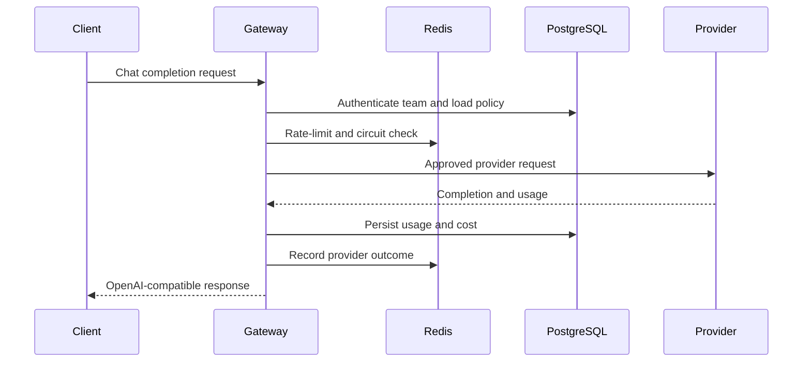
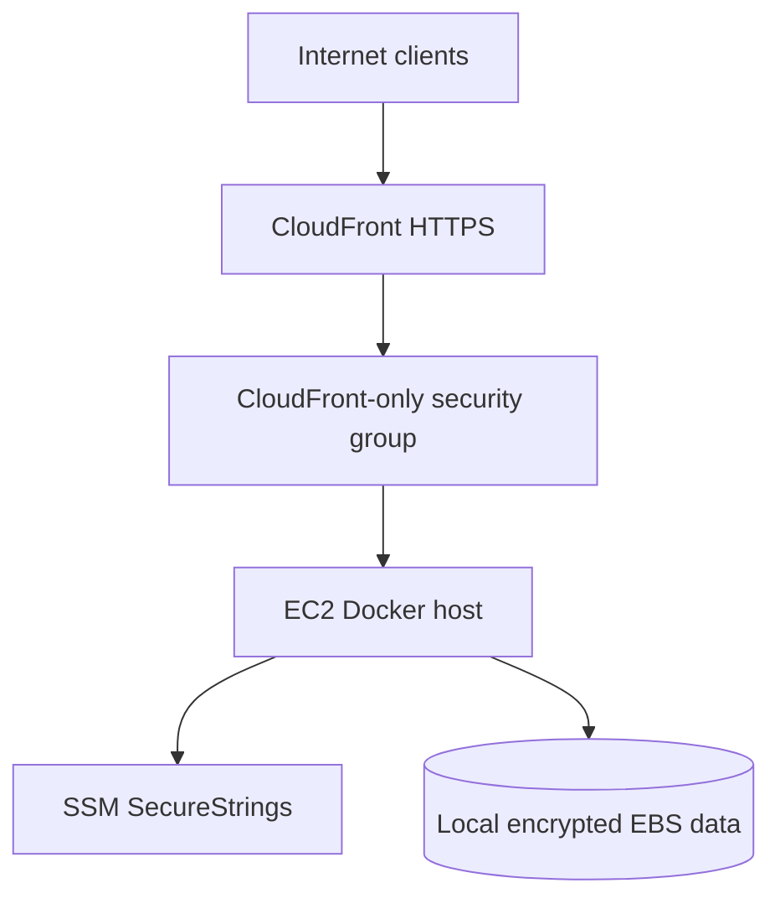

# ModelBudget Architecture

## System purpose

ModelBudget sits between application teams and LLM providers. It centralizes authentication, budget policy, prompt governance, request routing, reliability controls, usage accounting, and operator visibility.

## Components

| Component | Responsibility |
|---|---|
| FastAPI gateway | Validates requests and coordinates policy, routing, accounting, and telemetry |
| PostgreSQL | Durable teams, prompt versions, usage records, and migration state |
| Redis | Fast shared state for request limiting and circuit-breaker coordination |
| Provider adapter | Stable internal interface for mock and OpenAI-compatible execution |
| Next.js dashboard | Read-only operational view of teams, usage, prompts, and provider status |
| Caddy | Routes public paths internally to the gateway or dashboard |
| CloudFront | Public HTTPS endpoint and HTTP-to-HTTPS redirect |
| SSM Parameter Store | Encrypted production secrets |
| Terraform | Repeatable AWS networking, IAM, compute, and CDN configuration |

## Chat request sequence

Failures are recorded and mapped to controlled API responses. Provider failure does not bypass budget accounting or expose provider internals.

## Dashboard sequence

1. The browser posts a bounded JSON login request to the Next.js session route.
2. The route rejects absent or mismatched origins.
3. The password is compared in constant time.
4. A signed, expiring token is placed in an HttpOnly cookie.
5. Authenticated dashboard routes call a fixed allowlist of backend admin resources.
6. Next.js injects the backend admin key only from server-side environment state.
7. FastAPI returns sanitized aggregate data with no-store headers.

## AWS trust boundaries

- The browser trusts the CloudFront TLS endpoint.
- CloudFront reaches the origin over HTTP inside the controlled origin boundary.
- The security group accepts port 80 only from the AWS-managed CloudFront origin prefix list.
- The instance retrieves only the named production parameters allowed by its IAM policy.
- IMDSv2 reduces metadata credential exposure.
- SSM replaces inbound SSH administration.

## Data minimization

Usage accounting needs identifiers, token counts, prices, timing, outcome, provider, and model. It does not need raw prompts, full responses, credential hashes, or arbitrary tracing attributes. Admin responses and telemetry therefore use explicit allowlists.

## Reliability model

- PostgreSQL provides durable transactional records.
- Redis supports fast distributed coordination.
- Alembic provides forward schema evolution.
- Health checks and restart policies recover containers after reboot.
- Circuit breaking reduces pressure on failing providers.
- Download retries make first boot tolerant of transient network errors.
- EC2 stop/start was tested with persistent database state.

## Portfolio trade-offs

The AWS topology uses one EC2 instance to minimize idle cost and make the full system easy to demonstrate. That creates a single-host failure domain. A commercial deployment would separate stateless services from managed PostgreSQL and Redis, add multiple availability zones, backups, WAF/rate limiting at the edge, autoscaling, centralized observability, and automated deployment promotion.
